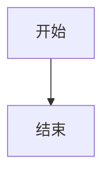

# AI纪元量化交易编程指南

通过简单编程，创建你的第一个交易系统。

## 交易系统

无论是程序化自动交易，还是凭借经验进行的主观交易。在开始之前，都需要定义我们的交易系统。

AI纪元量化平台采用主流的Python3语言来定义交易系统，文章的后半部分会详细说明交易系统定义的过程。

如果你没有编程基础也没有关系，AI纪元量化平台会给出示例代码。经典的海龟交易系统会作为它的第一个示例，而AI交易系统会作为第二个。
示例交易系统是可以直接运行的，你可以使用其它人在AI纪元量化平台编写好的交易系统来运行，或者Fork别人的交易系统改进成自己的系统。
回测系统

除非你想要亏光你的钱，或者只是纯赌博，否则在开始之前我们应当对交易系统进行检验。

就算无法精确计算出未来的收益，也至少应该知道系统在未来的预期收益是否为正。
回测系统被定义为一种能够使用历史数据对量化交易系统的收益和风险进行量化评估的系统。
回测系统是AI纪元量化平台的一部分，它以定义好的交易系统为输入，调用历史K线信息，输出回测报告。
通过回测报告，我们能够对量化交易系统进行评分。对于遗传算法来说，评分的准确性，直接决定了量化交易系统能否向正确的方向演化。

## 量化平台

以下内容使用“本平台”代指“AI纪元量化平台”。
通过高度抽象，我们将忽略交易的底层细节（数据库交互，底层交易接口的实现，ATR等指标的计算逻辑），仅通过少量的参数与高度抽象的脚本代码，来定义完整的量化交易系统。
定义好的交易系统可以既可以加载到模拟回测系统中，也可以加载到实盘交易系统中。
为了降低脚本编写的门槛，本平台使用目前主流的Python语言（版本3.10以上）来编写脚本。

## 自动交易框架

让我们回顾一下自动交易的执行过程，分析一下哪些过程是固定的，而哪些又是变化的？

### 信号/入市

首先是对市场和头寸的监控。所有量化交易系统都需要实时监控市场和头寸的状态，出现入市信号就应该入市，满足退出/止损条件就应该立即退出，满仓时要忽略入市信号，不能无限加仓。
对于不同的系统来说，要监控的指标是不一样的。
对于海龟交易系统来说，要监控的指标是10日/20日/55日通道的突破（下单/退出），以及通道突破后以0.5ATR为单位的二次突破（建仓/止损）。同一时间发生多个突破，选择信号最强的市场来操作（调用入市信号的计算函数来计算）。
对AI交易系统来说，要监控的指标是入市信号和退出信号强弱（由AI实时计算，入市信号大于0.5时入市）的变化（下单/建仓/退出）和头寸盈亏的变化（止损）。如果多个市场的均满足入市条件，选择入市信号最强的市场进行操作。

### 退出/止损

退出和止损是两种不同意义上的操作，尽管它们产生的效果都是头寸的退出。

止损操作是系统的最终安全屏障。
无论是哪种交易系统，对于每笔交易来说，我们都不应该让亏损无限放大，因为这会导致爆仓风险（对于带有杠杆的双向交易系统来说）。
我们应该在下单之前就设定好它的亏损上限。根据亏损上限，计算出相应的止损点。这个止损点可以是根据入市价格计算出的固定止损点，也可以是根据最大盈利点计算出的动态止损点。
由于止损是最终完全屏障，为了它能够100%的执行，应当使用立即执行的市价单，或先挂出限价单（相比市价单，具有成交价格的优势，但不会立即成交），如果无法在限定时间内交易完成，再转为市价单。
退出操作是依据市场的退出信号而发起的操作。一般在止损操作发生之前，市场就会转为恶劣，并触发退出操作。
对于海龟交易系统来说，当市场向亏损方向突破10日或20日极值时，触发退出操作；对于AI交易系统来说，当市场退出信号大于0.5时触发退出操作。
头寸单位

当决定入市的，需要一个公式来计算要入市的头寸单位的大小。当头寸单位达到上线时，应该输出0，表示忽略本次入市信号。
头寸的计算应该根据余额，ATR，风险系数，市场价格，以及当前已经持仓的头寸单位的个数。



## 输入/输出

系统的输入包括一个以trade_xxx命名的文件夹，其中xxx表示交易策略的具体名称，使用小写英文字符与数字来命名，长度在1到20之间。

文件夹中至少包含：“信号”，“入市脚本”，“头寸公式”，“退出脚本“与“参数设置”五个文件。

其中：“信号”，“入市脚本”，“头寸公式”，“退出脚本“是使用Python3编写的代码，命名为"signal.py", "entry.py", "position.py", "exit.py" 。包含了交易系统运行的基本逻辑（信号判定，入市，头寸规模，止损，退出…）。
参数是json格式的文件，命名为"config.json"，包含了交易系统运行的相关参数（参数范围，当前设置，间隔…）。

回测引擎读取五个输入文件后，调用已采集的K线数据，执行回测运算，并输出回测报告（初始余额、最终余额，交易时长，交易次数、胜率、年化收益，最大亏损、最长衰落期，MAR比率、余额波动标准差、夏普比率等）。

## 输入模版

signal.py
```Python3 
## signal.py
#入市信号
def entry_signal(indicators,config):
    '''
    indicators：k线与技术指标
    config：配置信息
    返回值：方向(买入buy卖出sell)，信号强度
    '''
    return "buy",0.5

#退出信号
def exit_signal(indicators,config):
    '''
    indicators：k线与指标数据
    config：配置信息
    返回值：方向(买入buy卖出sell)，信号强度
    注：入市时的买入操作对应退出时的卖出操作
    '''
    return "sell",0.5
```
entry.py
```Python3 
## entry.py
# 入市脚本
def entry(indicators,signal,balance,cur_position,next_position,config):
    '''
    indicators：k线与指标数据
    balance: 当前可用余额
    signal：市场信号
    cur_position：当前头寸
    next_position：下一个头寸
    config：配置信息
    返回值：操作结果(200表示成功，500表示失败)与操作后的新的头寸信息
    '''
    return 200,cur_position
```
position.py
```Python3 
#position.py
def position(indicators,balance,cur_position,config):
    '''
    indicators: k线与指标数据
    balance: 当前可用余额
    cur_position：当前头寸
    config：配置信息
    返回值：头寸单元大小
    '''
    return 0.0
```
exit.py
```Python3
## exit.py
# 退出脚本
def exit(indicators,signal,exit_position,config):
    '''
    indicators：k线与指标数据
    signal：市场信号
    exit_position：要退出的头寸
    config：配置信息
    返回值：操作结果(200表示成功，500表示失败)
    '''
    return 200
```
config.json
```json 
{
    "risk_factor":1.0
    "exchange":"bitstamp"
    "markets": ["BTC/EUR"]
}
```

## 样例一：海龟交易系统

### 输入样例
signal.py
```Python3 
## signal.py
#入市信号
def entry_signal(indicators,config):
    '''
    indicators：k线与技术指标
    config：配置信息
    返回值：方向(买入buy卖出sell)，信号强度
    '''
    return "buy",0.5

#退出信号
def exit_signal(indicators,config):
    '''
    indicators：k线与指标数据
    config：配置信息
    返回值：方向(买入buy卖出sell)，信号强度
    注：入市时的买入操作对应退出时的卖出操作
    '''
    return "sell",0.5
```
entry.py
```Python3 
## entry.py
# 入市脚本
def entry(indicators,signal,balance,cur_position,next_position,config):
    '''
    indicators：k线与指标数据
    balance: 当前可用余额
    signal：市场信号
    cur_position：当前头寸
    next_position：下一个头寸
    config：配置信息
    返回值：操作结果(200表示成功，500表示失败)与操作后的新的头寸信息
    '''
    return 200,cur_position
```
position.py
```Python3 
#position.py
def position(indicators,balance,cur_position,config):
    '''
    indicators: k线与指标数据
    balance: 当前可用余额
    cur_position：当前头寸
    config：配置信息
    返回值：头寸单元大小
    '''
    return 0.0
```
exit.py
```Python3
## exit.py
# 退出脚本
def exit(indicators,signal,exit_position,config):
    '''
    indicators：k线与指标数据
    signal：市场信号
    exit_position：要退出的头寸
    config：配置信息
    返回值：操作结果(200表示成功，500表示失败)
    '''
    return 200
```
config.json
```json 
{
    "risk_factor":1.0
    "exchange":"bitstamp"
    "markets": ["BTC/EUR"]
}
```

AI纪元量化平台项目地址：https://github.com/trder/

API参考文档：https://github.com/trder/APIReference
